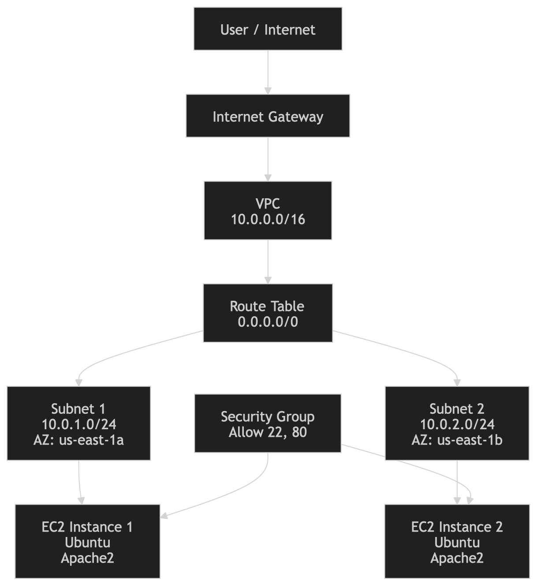

# AWS Apache Web Server Infrastructure with Terraform

This project automates the deployment of a highly available Apache web server infrastructure on AWS using Terraform.

## Architecture Overview



The infrastructure consists of the following components:
- **VPC**: A custom Virtual Private Cloud with a `10.0.0.0/16` CIDR block.
- **Subnets**: Two public subnets in different Availability Zones (`us-east-1a` and `us-east-1b`) for high availability.
- **Internet Gateway**: Allows communication between the VPC and the internet.
- **Route Table**: Configured to route external traffic to the Internet Gateway.
- **Security Group**: Permits inbound traffic on port 80 (HTTP) and port 22 (SSH), and all outbound traffic.
- **EC2 Instances**: Two `t2.micro` Ubuntu instances, one in each subnet, running Apache.
- **Provisioning**: A shell script (`install_apache.sh`) is used as `user_data` to automatically install and start Apache on boot.
- **Outputs**: The public IP addresses of the deployed servers are saved to a local file named `server_ips.txt`.

## Prerequisites

- [Terraform](https://www.terraform.io/downloads.html) installed.
- [AWS CLI](https://aws.amazon.com/cli/) configured with appropriate credentials.
- An AWS account.

## Project Structure

- `main.tf`: The primary Terraform configuration file containing all resource definitions.
- `install_apache.sh`: A shell script used for bootstrapping the EC2 instances.
- `.gitignore`: Specifies files and directories that should be ignored by Git.

## Getting Started

1. **Initialize Terraform**:
   ```bash
   terraform init
   ```

2. **Review the Execution Plan**:
   ```bash
   terraform plan
   ```

3. **Deploy the Infrastructure**:
   ```bash
   terraform apply
   ```
   *Note: You will be prompted to confirm the action. Type `yes` to proceed.*

4. **Verify the Deployment**:
   Once the apply is complete, you can find the public IPs of your servers in `server_ips.txt`. Open these IPs in a web browser to see the Apache default page.

## Cleanup

To destroy the infrastructure and avoid ongoing costs:
```bash
terraform destroy
```

## License

This project is licensed under the MIT License.
